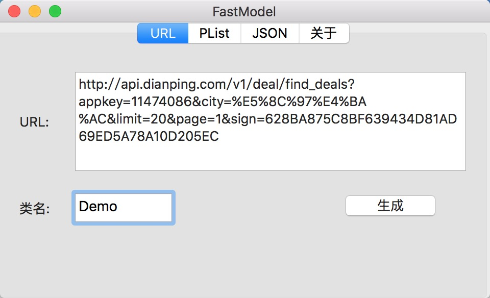
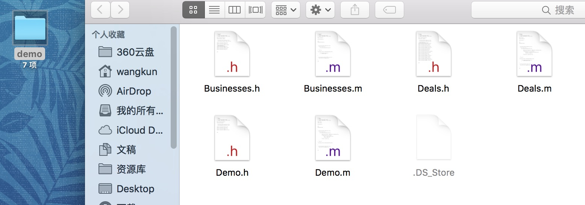

# VXXFastModel
一个可以将url或者是文件转化成数据模型的小工具.让你不用手写模型
###使用方法
* 1.运行程序.
* 2.在URL选项卡中,粘贴你需要的生成的URL.
* 3.输入需要生成文件的文件名.
* 4.点击生成,在桌面会生成一个文件夹,文件夹名为你输入的类名.
* 5.将生成的文件添加到你的项目中.

###功能介绍
* 1.可以用一个URL生成若干个.M和.h模型文件,简化开发时,编写模型繁琐操作,URL获取的数据仅限JSON其他数据类型暂时不支持.
* 1.1能够解析复杂的模型嵌套模型,并且自动生成模型嵌套的构造方法,将字典和数据全部转化成对应模型类.
* 1.2自动生成模型嵌套等头文件.
* 1.3解决数据模型中可能有关键字时的冲突,自动将oc语言中的关键字后面加小写的x(例:模型中有一个属性是id,它将自动将转化成idx).
* 1.4如果json数据第一个节点是array,自动生成便利构造器.

* 2.将JSon文件转化成模型(未实现)

* 3.支持XML(未实现) 

###工具截图

工具界面:

生成的文件:
